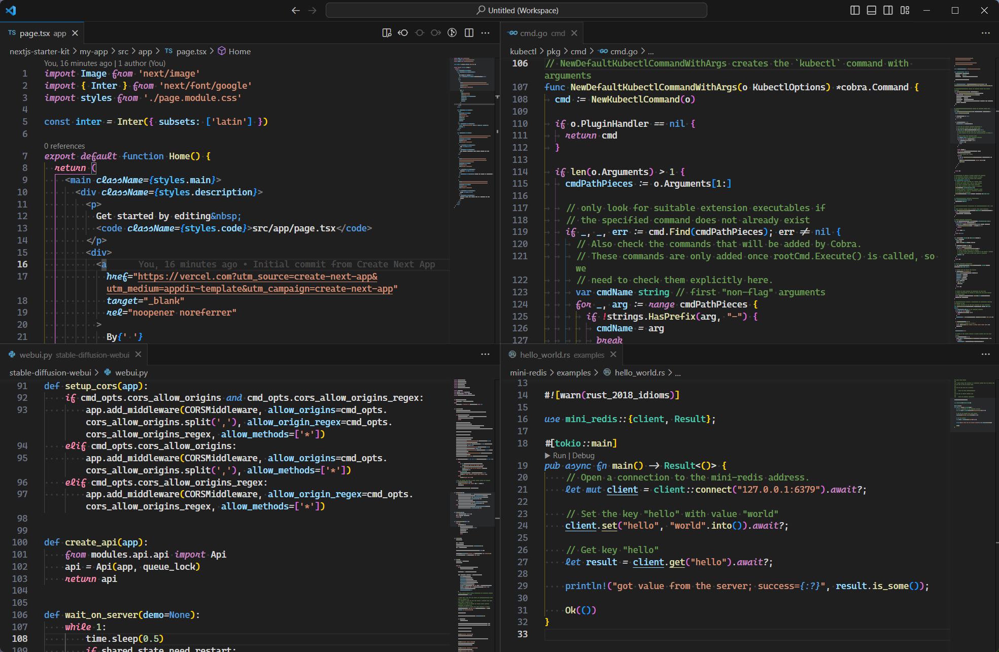

# Dark+ V2 Italic

A splash of italics added to the new and experimental Dark+ V2 theme added in Visual Studio Code
1.75 in January 2023. Make your script fonts shine! This theme is inspired by [Dark++
Italic](https://marketplace.visualstudio.com/items?itemName=idbartosz.darkpp-italic), a minimal
modification of the default theme to add italics to highlight script fonts.

My font of choice is [Microsoft's Cascadia Code](https://github.com/microsoft/cascadia-code), modified with the [Nerd Fonts](https://www.nerdfonts.com/) patcher to add script italics. This font can be found in a fork of Nerd Fonts at https://github.com/AaronFriel/nerd-fonts/releases.

The screenshot uses this theme, with the "Caskaydia Code" remix of Cascadia Code built with script italics.
